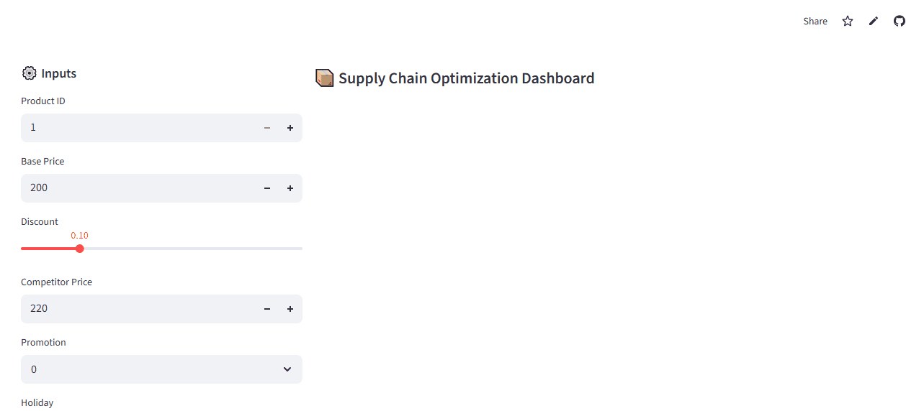
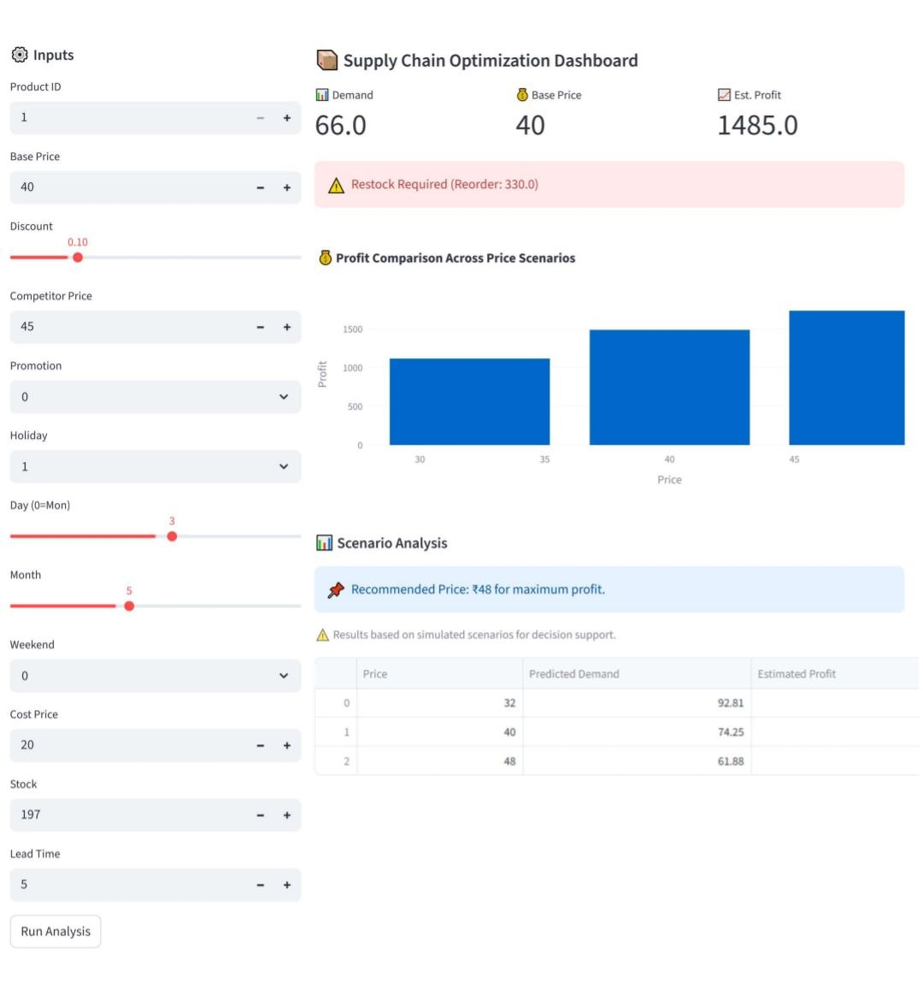

# Supply Chain Optimization & Demand Forecasting System
An end-to-end data-driven supply chain application that combines machine learning-based demand forecasting with inventory and price optimization to support better operational and profitability decisions.

---

## Problem
Businesses need to balance inventory availability, customer demand, and profitability.

Common challenges include:

- Stockouts resulting in lost sales
- Overstocking and unnecessary inventory costs
- Uncertainty in product demand
- Inefficient pricing decisions
- Difficulty evaluating different price scenarios

---

## Solution

This application combines machine learning and business logic to provide data-driven supply chain recommendations.

The system:

- Forecasts product demand
- Estimates the reorder point based on predicted demand and lead time
- Evaluates multiple pricing scenarios
- Estimates profit under different prices
- Identifies the price that produces the highest estimated profit
- Provides an interactive dashboard for decision support 

---

## Demo

---

## App Screenshot

---

## Features

Demand Forecasting
Uses a trained Random Forest Regressor to estimate product demand from product, pricing, calendar, promotion, inventory, and market-related features.

Inventory Optimization
Calculates a reorder point using predicted demand and lead time and indicates whether current inventory requires replenishment.

Price Optimization
Evaluates multiple price scenarios around the base price and estimates demand and profit for each scenario.

Scenario Analysis
Provides a visual comparison of estimated profit across different pricing scenarios using an interactive Plotly chart.

Interactive Dashboard
Built with Streamlit for real-time input, prediction, analysis, and decision support.

---

## Machine Learning

Model: Random Forest Regressor

Target: units_sold

Input Features
Product ID
Day of Week
Month
Weekend
Price
Discount
Cost Price
Competitor Price
Promotion
Holiday
Current Stock
Lead Time

Model Performance
R² Score: 0.778
MAE: 7.06

These metrics were obtained during model evaluation on the project dataset.

---

## Sample Results

Example output generated by the application:
Predicted Demand: 87.87 units
Base Price: ₹200
Estimated Profit: ₹7,152.62
Reorder Point: 263.61 units
Recommended Price: ₹240

The application also compares multiple price scenarios and recommends the price with the highest estimated profit.

Note: Results are based on model predictions and simulated pricing scenarios and are intended for decision support rather than guaranteed business outcomes.
---

## Tech Stack

- Python  
- Pandas  
- Scikit-learn  
- Streamlit
- Joblib
- Plotly
- Machine Learning
- Data Analysis
- Supply Chain Optimization

---

## 🌐 Live App

👉 [Click to try the app](https://supply-chain-optimization-app-csjvboweuc28piacpjdj3s.streamlit.app/)

